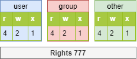
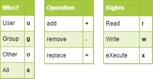

# Linux commands

## *General*
### `cat` command

The `cat` command concatenates the contents of multiple files and displays the result on the standard output.

```bash
cat file1 [files]
```

Example 1 - Displaying the contents of a file to the standard output:

```bash
$ cat /etc/passwd
```

Example 2 - Displaying the contents of multiple files to standard output:

```bash
$ cat /etc/passwd /etc/group
```

Example 3 - Combining the contents of multiple files into one file using output redirection:

```bash
$ cat /etc/passwd /etc/group > usersAndGroups.txt
```

Example 4 - Displaying the line numbering:

```bash
$ cat -n /etc/profile
     1    # /etc/profile: system-wide .profile file for the Bourne shell (sh(1))
     2    # and Bourne compatible shells (bash(1), ksh(1), ash(1), ...).
     3
     4    if [ "`id -u`" -eq 0 ]; then
     5      PATH="/usr/local/sbin:/usr/local/bin:/usr/sbin:/usr/bin:/sbin:/bin"
     6    else
…
```

Example 5 - Shows the numbering of non-empty lines:

```bash
$ cat -b /etc/profile
     1    # /etc/profile: system-wide .profile file for the Bourne shell (sh(1))
     2    # and Bourne compatible shells (bash(1), ksh(1), ash(1), ...).

     3    if [ "`id -u`" -eq 0 ]; then
     4      PATH="/usr/local/sbin:/usr/local/bin:/usr/sbin:/usr/bin:/sbin:/bin"
     5    else
…
```

### `cd` command

The `cd` (Change Directory) command allows you to change the current directory -- in other words, to move through the tree.

```bash
$ cd /tmp
$ pwd
/tmp
$ cd ../
$ pwd
/
$ cd
$ pwd
/home/vaibhavraj
```

As you can see in the last example above, the command `cd` with no arguments moves the current directory to the `home directory`.


### `clear` command

The `clear` command clears the contents of the terminal screen. More accurately, it shifts the display so that the command prompt is at the top of the screen on the first line.

### `cp` command

The `cp` command copies a file.

```bash
cp file [file ...] destination
```

Example:

```bash
$ cp -r /home/vaibhavraj /tmp
```

| Options | Information                                                      |
| ------- | ---------------------------------------------------------------- |
| `-i`    | Request confirmation if overwriting (default).                   |
| `-f`    | Do not ask for confirmation if overwriting the destination file. |
| `-p`    | Keeps the owner, permissions and timestamp of the copied file.   |
| `-r`    | Copies a directory with its files and subdirectories.            |
| `-s`    | Creates a symbolic link rather than copying.                    |

```bash
cp file1 /repexist/file2
```

`file1` is copied to `/repexist` under the name `file2`.

```bash
$ cp file1 file2
```

`file1` is copied as `file2` to this directory.

```bash
$ cp file1 /wrongrep
```

If the destination directory does not exist, `file1` is copied under the name `wrongrep` to the root directory.

### `mv` command

The `mv` command moves and renames a file.

```bash
mv file [file ...] destination
```

Examples:

```bash
$ mv /home/vaibhavraj/file1 /home/vaibhavraj/file2
$ mv /home/vaibhavraj/file1 /home/vaibhavraj/file2 /tmp
```

| Options                                                                        | Information                                                     |
| ------------------------------------------------------------------------------ | --------------------------------------------------------------- |
| `-f`                                                                           | Don't ask for confirmation if overwriting the destination file. |
| `-i`                                                                           | Request confirmation if overwriting destination file (default). |

Examples:

```bash
$ mv /home/vaibhavraj/file1 /home/vaibhavraj/file2
```

Renames `file1` to `file2`. If `file2` already exists, replace the contents of the file with `file1`.

```bash
$ mv /home/vaibhavraj/file1 /home/vaibhavraj/file2 /tmp
```

Moves `file1` and `file2` into the `/tmp` directory.

```bash
$ mv file1 /repexist/file2
```

Moves `file1` into `repexist` and renames it `file2`.

```bash
$ mv file1 file2
```

`file1` is renamed to `file2`.

```bash
$ mv file1 /repexist
```

If the destination directory exists, `file1` is moved to `/repexist`.

```bash
$ mv file1 /wrongrep
```

If the destination directory does not exist, `file1` is renamed to `wrongrep` in the root directory.


### `rm` command

The `rm` command deletes a file or directory.

```bash
rm [-f] [-r] file [file] [...]
```

| Options | Information                              |
| ------- | ---------------------------------------- |
| `-f`    | Do not ask whether to delete. |
| `-i`    | Ask whether to delete.       |
| `-r`    | Delete a directory and recursively delete its subdirectories.      |

Deleting a folder with the `rm` command, whether the folder is empty or not, will require the `-r` option to be added.

```shell
rm -rf directory        # To delete a non-empty directory
```
### `history` command

The `history` command displays the history of commands that have been entered by the user.

The commands are stored in the `.bash_history` file in the user's login directory.

Example of a history command

```bash
$ history
146 clear
147 man ls
148 man history
```

| Options | Comments                                                                                                           |
| ------- | ------------------------------------------------------------------------------------------------------------------ |
| `-w`    | Writes the current history to the history file.                                                |
| `-c`    | Deletes the history of the current session (but not the contents of the `.bash_history` file). |

To manipulate the history, the following commands entered from the command prompt will:

| Keys               | Function                                                  |
| ------------------ | --------------------------------------------------------- |
| <kdb>!!</kdb>      | Recalls the last command placed.                           |
| <kdb>!n</kdb>      | Recalls the command by its number in the list.             |
| <kdb>!string</kdb> | Recalls the most recent command beginning with the string. |
| <kdb>↑</kdb>       | Navigates through your history working backward in time from the most recent command. |
| <kdb>↓</kdb>       | Navigates through your history working forward in time. |

### `ls` command

The `ls` command displays the contents of a directory.

```bash
ls [-a] [-i] [-l] [directory1] [directory2] […]
```

Example:

```bash
$ ls /home
.    ..    vaibhavraj
```

The main options of the `ls` command are:

| Option                                                       | Information                                                                                                                          |
| ------------------------------------------------------------ | ------------------------------------------------------------------------------------------------------------------------------------ |
| `-a`                                                         | Displays all files, even hidden ones. Hidden files in Linux are those beginning with `.`.                                            |
| `-i`                                                         | Displays inode numbers.                                                                                                              |
| `-l`                                                         | Use a long listing format, that is, each line displays long format information for a file or directory.                                 |

* Description of columns generated by running the `ls -lia` command:

```bash
$ ls -lia /home
7077906 drwxr-xr-x 23 vaibhavraj vaibhavraj 4096 Mar 8 11:48 vaibhavraj
```

| Value           | Information                                                                                                   |
| --------------- | ------------------------------------------------------------------------------------------------------------- |
| `7077906`         | Inode Number.                                                                                                 |
| `drwxr-xr-x`    | File type (`d`) and rights (`rwxr-xr-x`).                                                                     |
| `23`             | Number of subdirectories (`.` and `..` included). For a file, it represents the number of hard links, and 1 represents itself. |
| `vaibhavraj`      | User ownership.                                                                                               |
| `vaibhavraj`      | Group ownership.                                                                                              |
| `4096`          | For files, it shows the size of the file. For directories, it shows the fixed value of 4096 bytes occupied by the file naming. To calculate the total size of a directory, use `du -sh vaibhavraj/` |
| `Mar  8 11:48` | Last modified date.                                                                                           |
| `vaibhavraj`      | The name of the file (or directory).                                                                          |

The `ls` command has many options. Here are some advanced examples of uses:

* List the files in `/etc` in order of last modification:

```bash
$ ls -ltr /etc
total 1332
-rw-r--r--.  1 root root    662 29 may   2021 logrotate.conf
-rw-r--r--.  1 root root    272 17 may.   2021 mailcap
-rw-------.  1 root root    122 12 may.  2021 securetty
...
-rw-r--r--.  2 root root     85 18 may.  17:04 resolv.conf
-rw-r--r--.  1 root root     44 18 may.  17:04 adjtime
-rw-r--r--.  1 root root    283 18 may.  17:05 mtab
```

* Show the rights on a folder:

To find out the rights to a folder, in our example `/etc`, the following command would **not** be appropriate:

```bash
$ ls -l /etc
total 1332
-rw-r--r--.  1 root root     44 18 nov.  17:04 adjtime
-rw-r--r--.  1 root root   1512 12 janv.  2010 aliases
-rw-r--r--.  1 root root  12288 17 nov.  17:41 aliases.db
drwxr-xr-x.  2 root root   4096 17 nov.  17:48 alternatives
...
```

The above command will display the contents of the folder (inside) by default. For the folder itself, you can use the `-d` option.

```bash
$ ls -ld /etc
drwxr-xr-x. 69 root root 4096 18 nov.  17:05 /etc
```

* Sort by file size, largest first:

```bash
$ ls -lhS
```

* time/date format with `-l`:

```bash
$ ls -l --time-style="+%Y-%m-%d %m-%d %H:%M" /
total 12378
dr-xr-xr-x. 2 root root 4096 2014-11-23 11-23 03:13 bin
dr-xr-xr-x. 5 root root 1024 2014-11-23 11-23 05:29 boot
```

* Add the _trailing slash_ to the end of folders:

By default, the `ls` command does not display the last slash of a folder.
In some cases, like for scripts for example, it is useful to display them:

```bash
$ ls -dF /etc
/etc/
```

* Hide some extensions:

```bash
$ ls /etc --hide=*.conf
```

### `man` command

Once found by `apropos` or `whatis`, the manual is read by `man` ("Man is your friend").
This set of manuals is divided into 8 sections, grouping information by topic, the default section being 1:

1. Executable programs or commands.
2. System calls (functions given by the kernel).
3. Library calls (functions given by the library).
4. Special files (usually found in /dev).
5. File Formats and conventions (configuration files such as etc/passwd).
6. Games (such as character-based applications).
7. Miscellaneous (e.g. man (7)).
8. System administration commands (usually only for root).
9. Kernel routines (non-standard).

Information about each section can be accessed by typing `man x intro`, where `x` is the section number.

The command:

```bash
man passwd
```

will tell the administrator about the passwd command, its options, etc. While a:

```bash
$ man 5 passwd
```

will inform him about the files related to the command.

Navigate through the manual with the arrows <kbd>↑</kbd> and <kbd>↓</kbd>. Exit the manual by pressing the <kbd>q</kbd> key.

### `mkdir` command

The `mkdir` command creates a directory or directory tree.

```bash
mkdir [-p] directory [directory] [...]
```

Example:

```bash
$ mkdir /home/vaibhavraj/work
```

The "vaibhavraj" directory must exist to create the "work" directory.

Otherwise, the `-p` option should be used. The `-p` option creates the parent directories if they do not exist.

### `dir` command

> `dir` is equivalent to `ls -C -b` that is, by default files are listed in columns, sorted vertically, and special characters are represented by backslash escape sequences.

### `find` command
```
find . -name '*js'
```
Find all the files under the current tree that have the .js extension and print the relative path of each file matching

```
find . -type d -name src
```
Find directories under the current tree matching the name "src"

```
find folder1 folder2 -name filename.txt
```
Search under multiple root trees

```
find . -type f -size +100k -size -1M
```
Search files bigger than 100KB but smaller than 1MB

```
find . -type f -mtime +3
```
Search files edited more than 3 days ago

```
find . -type f -exec cat {} \;
```
Execute a command on each result of the search. In this example we run cat to print the file content notice the terminating \\; . The {} is filled with the file name at execution time.

### `date` command

The `date` command displays the date and time. The command has the following syntax:

```bash
date [-d AAAAMMJJ] [format]
```

Examples:

```bash
$ date
Thursday 09 March 2023 12:26:41 PM IST
$ date -d 20210517 +%j
137
```

In this last example, the `-d` option displays a given date. The `+%j` option formats this date to show only the day of the year.

The date display can follow the following formats:

| Option  | Format                                                    |
| --------| --------------------------------------------------------- |
| `+%A`   | Locale's full weekday name (e.g., Sunday)                 |
| `+%B`   | Locale's full month name (e.g., January)                  |
| `+%c`   | Locale's date and time (e.g., Thu Mar  3 23:05:25 2005)   |
| `+%d`   | Day of month (e.g., 01)                                   |
| `+%F`   | Date in `YYYY-MM-DD` format                               |
| `+%G`   | Year                                                      |
| `+%H`   | Hour (00..23)                                             |
| `+%j`   | Day of the year (001..366)                                |
| `+%m`   | Month number (01..12)                                     |
| `+%M`   | Minute  (00..59)                                          |
| `+%R`   | Time in `hh:mm` format                                    |
| `+%s`   | Seconds since January 1, 1970                             |
| `+%S`   | Second (00..60)                                           |
| `+%T`   | Time in `hh:mm:ss` format                                 |
| `+%u`   | Day of the week (`1` for Monday)                          |
| `+%V`   | Week number (`+%V`)                                       |
| `+%x`   | Date in format `DD/MM/YYYY`                               |

The `date` command also allows you to change the system date and time. In this case, the `-s` option will be used.

```bash
date -s "2021-05-24 10:19"
```

The format to be used following the `-s` option is this:

```bash
date -s "[AA]AA-MM-JJ hh:mm:[ss]"
```

### `touch` command

The `touch` command changes the timestamp of a file or creates an empty file if the file does not exist.

```bash
touch [-t date] file
```

Example:

```bash
$ touch /home/vaibhavraj/myfile
```

| Option                            | Information                                                                |
| --------------------------------- | -------------------------------------------------------------------------- |
| `-t date`                         | Changes the date of last modification of the file with the specified date. |

Date format: `[AAAA]MMJJhhmm[ss]`

### `export` command

The `export` command is used to export variables to child processes.

```
export TEST="test"
```

```
export PATH=$PATH:/new/path
```

### `shutdown` command

The `shutdown` command allows you to **electronically shut down** a Linux server, either immediately or after a certain period of time.

```bash
shutdown [-h] [-r] time [message]
```

Specify the shutdown time in the format `hh:mm` for a precise time, or `+mm` for a delay in minutes.

To force an immediate stop, use the word `now` in place of the time. In this case, the optional message is not sent to other users of the system.

Examples:

```bash
shutdown -h 0:30 "Server shutdown at 0:30"
shutdown -r +5
```

Options:

| Options | Remarks                          |
| ------- | -------------------------------- |
| `-h`    | Shuts down the system electronically. |
| `-r`    | Restarts the system.              |


## **Text manipulation**
### `cut` command
The `cut` command lets you remove sections from each line of files. Print selected parts of lines from each FILE to standard output. With no FILE, or when FILE is -, read standard input.

1. Selecting specific fields in a file
```
cut -d "delimiter" -f (field number) file.txt
```

2. Selecting specific characters:
```
cut -c [(k)-(n)/(k),(n)/(n)] filename
```
Here, **k** denotes the starting position of the character and **n** denotes the ending position of the character in each line, if _k_ and _n_ are separated by “-” otherwise they are only the position of character in each line from the file taken as an input.

3. Selecting specific bytes:
```
cut -b 1,2,3 filename 			//select bytes 1,2 and 3
cut -b 1-4 filename				//select bytes 1 through 4
cut -b 1- filename				//select bytes 1 through the end of file
cut -b -4 filename				//select bytes from the beginning till the 4th byte
```
**Tabs and backspaces** are treated like as a character of 1 byte.

```
cut OPTION... [FILE]...
```

#### Additional Flags and their Functionalities:

|**Short Flag**   |**Long Flag**   |**Description**   |
|:---|:---|:---|
|`-b`|`--bytes=LIST`|select only these bytes|
|`-c`|`--characters=LIST`|select only these characters|
|`-d`|`--delimiter=DELIM`|use DELIM instead of TAB for field delimiter|
|`-f`|`--fields`|select only these fields;  also print any line that contains no delimiter character, unless the -s option is specified|
|`-s`|`--only-delimited`|do not print lines not containing delimiters|
|`-z`|`--zero-terminated`|line delimiter is NUL, not newline|


### `echo` command

The `echo` command is used to display a string of characters.

This command is most commonly used in administration scripts to inform the user during execution.

The `-n` option indicates no newline output string (by default, newline output string).

```bash
shell > echo -n "123";echo "456"
123456

shell > echo "123";echo "456"
123
456
```

For various reasons, the script developer may need to use special sequences (starting with a `\` character). In this case, the `-e` option will be stipulated, allowing interpretation of the sequences.

Among the frequently used sequences, we can mention:

| Sequence | Result                |
| -------- | --------------------- |
| `\a`     | Sends a sonar beep      |
| `\b`     | Back                  |
| `\n`     | Adds a line break     |
| `\t`     | Adds a horizontal tab |
| `\v`     | Adds a vertical tab     |


### `grep` command

The `grep` command searches for a string in a file.

```bash
grep [-w] [-i] [-v] "string" file
```

Example:

```bash
$ grep -w "root:" /etc/passwd
root:x:0:0:root:/root:/bin/bash
```

| Option                                                                                  | Description                             |
| --------------------------------------------------------------------------------------- | --------------------------------------- |
| `-i`                                                                                    | Ignores the case of the searched string. |
| `-v`                                                                                    | Excludes lines containing the string.   |
| `-w`                                                                                    | Searches for the exact word.              |

The `grep` command returns the complete line containing the string you are looking for.
* The `^` special character is used to search for a string at the beginning of a line.
* The special character `$` searches for a string at the end of a line.

```bash
$ grep -w "^root" /etc/passwd
```

It is possible to search for a string in a file tree with the `-R` option.

```bash
grep -R "Virtual" /etc/httpd
```

### `head` command

The `head` command displays the beginning of a file.

```bash
head [-n x] file
```

| Option                                                                                                | Description                            |
| ----------------------------------------------------------------------------------------------------- | --------------------------------------- |
| `-n x`                                                                                                | Display the first `x` lines of the file |

By default (without the `-n` option), the `head` command will display the first 10 lines of the file.

### `tail` command

The `tail` command displays the end of a file.

```bash
tail [-f] [-n x] file
```

| Option   | Description                             |
| -------- | ----------------------------------------- |
| `-n x`   | Displays the last `x` lines of the file   |
| `-f`     | Displays changes to the file in real time |

Example:

```bash
tail -n 3 /etc/passwd
sshd:x:74:74:Privilege-separeted sshd:/var/empty /sshd:/sbin/nologin
tcpdump::x:72:72::/:/sbin/nologin
user1:x:500:500:grp1:/home/user1:/bin/bash
```
Without the `-n` option, the `tail` command displays the last 10 lines of the file.


## **sysadmin**
### `passwd` command

The `passwd` command is used to manage a password.

```
passwd [-d] [-l] [-S] [-u] [login]
```

Examples:

```shell
passwd -l albert
passwd -n 60 -x 90 -w 80 -i 10 patrick
```

| Option | Description                                            |
| ------ | ------------------------------------------------------ |
| `-d` | Permanently removes the password. For root (uid=0) use only.         |
| `-l` | Permanently lock user account. For root (uid=0) use only.            |
| `-S` | Displays the account status. For root (uid=0) use only.  |
| `-u` | Permanently unlocks user account. For root (uid=0) use only.          |
| `-e` | Permanently expires the password. For root (uid=0) use only.         |
| `-n DAYS` | Minimum password lifetime. Permanent change. For root (uid=0) use only. |
| `-x DAYS` | Maximum password lifetime. Permanent change. For root (uid=0) use only. |
| `-w DAYS` | Warning time before expiration. Permanent change. For root (uid=0) use only. |
| `-i DAYS` | Delay before deactivation when the password expires. Permanent change. For root (uid=0) use only.|

Use `password -l`, that is, add "!!" at the beginning of the password field of the user corresponding to `/etc/shadow`.

Example:

* Alain changes his password:

```
[alain]$ passwd
```

* root changes Alain's password

```
$ sudo passwd alain
```

They will have to comply with the security restrictions.

When managing user accounts by shell script, it may be useful to set a default password after creating the user.

This can be done by passing the password to the `passwd` command.

Example:

```
$ sudo echo "azerty,1" | passwd --stdin philippe
```

### `adduser` command

The `adduser` command is used to add a new user to a linux system 

```shell
sudo adduser newuser
```
After this command is executed you will be required to respond to a series of questions:

1. Assign and confirm a password for the new user.
2. Enter any additional information about the new user. This is optional and can be skipped by pressing ENTER if you don’t wish to utilize these fields.
3. Finally, you’ll be asked to confirm that the information you provided was correct. Press Y to continue.

#### Granting a User Sudo Privileges
Use the `visudo` command, which opens a configuration file called `/etc/sudoers` in the system’s default editor, and explicitly specify privileges on a per-user basis.

Using `visudo` is the only recommended way to make changes to `/etc/sudoers` because it locks the file against multiple simultaneous edits and performs a validation check on its contents before overwriting the file. This helps to prevent a situation where you misconfigure sudo and cannot fix the problem because you have lost sudo privileges.

```shell
sudo visudo
```

```/etc/sudoers
root    ALL=(ALL:ALL) ALL
newuser ALL=(ALL:ALL) ALL       # Add this line
```

### `deluser` command

To delete the user itself, without deleting any of their files
```shell
sudo deluser newuser
```

If, instead, you want to delete the user’s home directory when the user is deleted
```shell
sudo deluser --remove-home newuser
```

If you previously configured sudo privileges for the user you deleted, you may want to remove the relevant line again:

```shell
sudo visudo
```
```/etc/sudoers
root    ALL=(ALL:ALL) ALL
newuser ALL=(ALL:ALL) ALL   # DELETE THIS LINE
```

>This will prevent a new user created with the same name from being accidentally given sudo privileges.


### `addgroup` command

To create a new group
```shell
sudo addgroup GROUPNAME
```

To add users to a group
```shell
sudo adduser USERNAME GROUPNAME – adds user to group
```

### `delgroup` command

To delete a group
```shell
sudo delgroup GROUPNAME
```
To delete users from a group
```shell
sudo deluser USERNAME GROUPNAME
```

### `chmod` command

The `chmod` command allows you to change the access permissions to a file.

```
chmod [option] mode file
```

| Option |	Observation                                                           |
|--------|------------------------------------------------------------------------|
| `-R`   |  Recursively change the permissions of the directory and all files under the directory. |

The mode indication can be an octal representation (e.g. `744`) or a symbolic representation ([`ugoa`][`+=-`][`rwxst`]).

#### Octal （or number）representation：

| Number | Description      |
| :---:  |      ---         |
| 4      |      r           |
| 2      |      w           | 
| 1      |      x           |
| 0      |      -           |

Add the three numbers together to get one user type permission. E.g. **755=rwxr-xr-x**.






!!! info

    Sometimes you will see `chmod 4755`. The number 4 here refers to the special permission **set uid**.
```
[root]# ls -l /tmp/fil*
-rwxrwx--- 1 root root … /tmp/file1
-rwx--x--- 1 root root … /tmp/file2
-rwx--xr-- 1 root root … /tmp/file3

[root]# chmod 741 /tmp/file1
[root]# chmod -R 744 /tmp/file2
[root]# ls -l /tmp/fic*
-rwxr----x 1 root root … /tmp/file1
-rwxr--r-- 1 root root … /tmp/file2
```

#### Symbolic representation

This method can be considered as a "literal" association between a user type, an operator, and rights.


```
[root]# chmod -R u+rwx,g+wx,o-r /tmp/file1
[root]# chmod g=x,o-r /tmp/file2
[root]# chmod -R o=r /tmp/file3
```

### `chown` command

The `chown` command allows you to change the owners of a file.
```
chown [-R] [-v] login[:group] file
```

Examples:
```
$ sudo chown root myfile
$ sudo chown albert:GroupA myfile
```

| Option |	Description                                           |
| ------ | ------------------------------------------------------ |
| `-R`   |	Recursively changes the owners of the directory and all files under the directory.|
| `-v`   |	Displays the executed changes.                        |

To change only the owner user:

```
$ sudo chown albert file
```

To modify only the owner group:

```
$ sudo chown :GroupA file
```

Changing the user and owner group:

```
$ sudo chown albert:GroupA file
```

In the following example the group assigned will be the primary group of the specified user.

```
$ sudo chown albert: file
```

Change the owner and group of all files in a directory

```
$ sudo chown -R albert:GroupA /dir1
```

### `ps` command
The `ps` command displays the status of running processes.
```
ps [-e] [-f] [-u login]
```

Example:
```
# ps -fu root
```

|  Option    |  Description                     |
|------------|----------------------------------|
| `-e`       | Displays all processes.          |
| `-f`       | Displays additional information. |
| `-u` login | Displays the user's processes.   |

Some additional options:

|  Option               |  Description                                      |
|-----------------------|---------------------------------------------------|
| `-g`                  | Displays the processes in the group.              |
| `-t tty`              | Displays the processes running from the terminal. |
| `-p PID`              | Displays the process information.                 |
| `-H`                  | Displays the information in a tree structure.     |
| `-I`                  | Displays additional information.                  |
| `--sort COL`          | Sort the result according to a column.            |
| `--headers`           | Displays the header on each page of the terminal. |
| `--format "%a %b %c"` | Customize the output display format.              |

Without an option specified, the `ps` command only displays processes running from the current terminal.

The result is displayed in columns:

```
# ps -ef
UID  PID PPID C STIME  TTY TIME      CMD
root 1   0    0 Jan01  ?   00:00/03  /sbin/init
```

| Column  |  Description                |
|----------|-----------------------------|
| `UID`    | Owner user.                 |
| `PID`    | Process identifier.         |
| `PPID`   | Parent process identifier.  |
| `C`      | Priority of the process.    |
| `STIME`  | Date and time of execution. |
| `TTY`    | Execution terminal.         |
| `TIME`   | Processing duration.        |
| `CMD`    | Command executed.           |

The behaviour of the control can be fully customized:

```
# ps -e --format "%P %p %c %n" --sort ppid --headers
 PPID   PID COMMAND          NI
    0     1 systemd           0
    0     2 kthreadd          0
    1   516 systemd-journal   0
    1   538 systemd-udevd     0
    1   598 lvmetad           0
    1   643 auditd           -4
    1   668 rtkit-daemon      1
    1   670 sssd              0
```

### `uname` command
* The uname command prints the system information.

### Common Examples
```shell
uname
uname - a
```

### Examples With Details
```shell
uname       # Print system information. Equivalent to uname -s.
uname -s    # Print the kernel name. Eg. Linux.
uname -n    # Print the network node hostname. Eg. dilbert-pc
uname -r    # Print the kernel release. Eg. 3.13.0-43-generic
uname -v    # Print the kernel version. Eg. #72-Ubuntu SMP Mon Dec 8 19:35:06 UTC 2014
uname -m    # Print the machine hardware name. Eg. x86_64. Useful to find out if the machine is 64-bit or 32-bit.
uname -p    # Print the processor type or "unknown". Eg. x86_64. Useful to find out if the machine is 64-bit or 32-bit.
uname -i    # Print the hardware platform or "unknown". Eg. i386. Useful to find out if the machine is 64-bit or 32-bit.
uname -o    # Print the operating system. Eg. GNU/Linux
uname -a    # Print all information in the above order.
```

### `which` command
* The which command locates a command.
* The which command returns the pathnames of the files (or links) which would be executed in the current environment,
    had its arguments been given as commands.
* The which command searches the PATH for executable files matching the names of the arguments.
* The which command does NOT follow symbolic links.

### Common Examples
```shell
which ls
```

### Examples With Details
```shell
which ls        # Outputs /bin/ls. Locate the executable file associated with a given command ls.
which ls rm     # Multiple arguments can be passed to which command. The exit status will be as follows,
                # 0 - if all specified commands are found and executable.
                # 1 - if one or more specified commands is nonexistent or not executable.
                # 2 - if an invalid option is specified.
which -a ls     # Use the -a switch to print all matching pathnames of each argument.
```

### `ln` command

Hard Links : Can't link to directories, and can't link to external filesystems
```
ln <original> <link>
```

Soft Links : Can link to other filesystems and to directories, but when the original is removed, the link will be broken
```
ln -s <original> <link>
```

### `crontab` command

```
crontab -l
```
list cron jobs

```
crontab -e
```
To edit cron jobs

* To generate cronjob commands use [this](https://crontab-generator.org/).

## *Networking*
### `ssh` command
* The ssh command is an Open SSH client.
* The ssh is an SSH client program for logging into a remote machine and for executing commands on a remote machine.
* It is intended to replace rlogin and rsh, and provide secure encrypted communications between two untrusted hosts
  over an insecure network.
* Steps for setting up an SSH client
    - Generate key pairs using ssh-keygen.
    - Setup local host (which runs SSH Client).
    - Setup remote host (which runs SSH Server).

#### Common Examples
```shell
ssh dilbert@jupiter
ssh jupiter
```

#### Examples With Details
```shell
ssh dilbert@jupiter                 # ssh to the remote host jupiter using the username dilbert. Username is Optional.
ssh jupiter                         # ssh to the remote host jupiter using the configuration file ~/.ssh/config.
ssh -2 jupiter                      # Default. Forces ssh to try protocol version 2 only. More secure than version 1.
ssh -6 jupiter                      # Forces ssh to use IPv6 addresses only. Use -4 for IPv4.
exit                                # Terminate ssh sessions from the server end.
Ctrl-d                              # Same as above.
logout                              # Same as above.
(RETURN)(RETURN)~.                  # Terminate SSH connection from the client end instead of the server end. This is
                                    # useful if connectivity is lost with the machine and there is no way of ending the
                                    # shell session.
ssh -F /path/to/config jupiter      # Specify SSH config file.
ssh -i /path/to/ssh-key jupiter     # Specify SSH private key file.
```

### `scp` command
* The scp command is a secure copy (remote file copy program) utility.

#### Common Examples
```shell
scp -C user@host1:/path/to/filename user@host2:filename
scp -C sshconfig:/path/to/filename user@host2:filename
scp -Cr cheetah:dilbert/test .
```

#### Examples With Details
```shell
scp user@host1:/path/to/filename user@host2:filename        # Common syntax.
scp sshconfig:/path/to/filename user@host2:filename         # Another common syntax if ssh is configured.
scp cheetah:dilbert/test/file1.txt .                        # Copy remote file "dilbert/test/file1.txt" on remote host
                                                            # "cheetah" to current local directory. Note the period.
scp t1.txt cheetah:dilbert/test/t4.txt                      # Copy local file t1.txt to remote location
                                                            # "dilbert/test/t4.txt" on remote host "cheetah".
scp cheetah:dilbert/test/\{t1.txt,t2.txt\} .                # Copy multiple remote files to current local directory at
                                                            # one shot.
scp -r cheetah:dilbert/test .                               # Copy a directory and all its subdirectories recursively.
scp -C cheetah:dilbert/test/t1.txt .                        # The -C flag enables compression by passing the flag to
                                                            # ssh.
scp -v cheetah:dilbert/test/t1.txt .                        # The -v flag is to run in verbose mode. Use -q flag for
                                                            # quiet mode.
scp dilbert@cheetah:t1.txt .                                # Prompts for password if ssh is not configured. Otherwise
                                                            # use ssh config for "cheetah".
scp -P22 user@cheetah:install.log .                         # -P flag is to specify port on remote host to run scp.
scp saturn:t1.txt cheetah:dilbert/t1.txt                    # Copies from host "B" to host "C" while logged into host
                                                            # "A". SSH config "cheetah" should exist on host "saturn"
                                                            # for this to work. Use -v option to explore more.
vim scp://cheetah/dilbert/t1.txt                            # Use VIM to open a remote file using scp. Syntax: vim
                                                            # scp://username@host/[/absolute]path/to/file.
scp -l10 user@urfix.com:/home/urfix/* .                     # Restrict Bandwidth for scp
vimdiff scp://[@]/                                          # Compare a remote file with a local file

# Copy something to multiple SSH hosts with a bash shell script loop.
for h in host1 host2 host3 host4 ; { scp file user@$h:/destination_path/ ; }
```

### `rsync` command
* The rsync command is a fast, versatile, remote (and local) file-copying tool.
* Use grsync tool for a GUI based rsync. Install it using sudo apt-get install grsync.
* Never run rsync without using the --dry-run option first. Only after you have completed several safe runs and
  verified no undesired files are copied, desired files are deleted, nothing is missing, and nothing has been
  modified without your consent, only then should you try copying files in earnest.
* Supports copying links, devices, owners, groups and permissions.
* It’s faster than scp (Secure Copy) because rsync uses remote-update protocol which allows to transfer just
  the differences between two sets of files. First time, it copies the whole content of a file or a directory
  from source to destination but from next time, it copies only the changed blocks and bytes to the destination.
* Rsync consumes less bandwidth as it uses compression and decompression method while sending and receiving data
  both ends.
* If source is a directory WITHOUT trailing spaces then it will be created in the destination directory otherwise
  it wont be.

#### Common Examples
```shell
rsync -avs --delete --dry-run -i dir1/ backup/
rsync -avs --delete -i dir1/ backup/
```

#### Examples With Details
```shell
rsync -avs dir1/ backup/                                            # General syntax is rsync FLAGS/OPTIONS SRC DEST
                                                                    # Use -a flag for all objects, -v for verbose output
                                                                    # and -s for not allowing remote shell to interpret
                                                                    # characters. The -s flag means file names with
                                                                    # spaces and special characters will not be
                                                                    # translated. This is needed especially if you have
                                                                    # Windows files, too.
rsync -avs --delete dir1/ backup/                                   # The --delete option will delete files at the
                                                                    # target/destination (backup), if they do not exist
                                                                    # in the source (dir1). This will always keep an up
                                                                    # to date list of files and the source and
                                                                    # destination will match. Also, the destination will
                                                                    # not slowly grow in size with older & irrelevant
                                                                    # content.
rsync -avs --delete --dry-run -i dir1/ backup/                      # The --dry-run option will give a detailed list of
                                                                    # what would have happened had you run for real.
rsync -avs --delete --log-file=rsync.log dir1/ backup/              # The --log-file=/path/to/file.log option will write
                                                                    # all changes to a log file.
rsync -avs -i --delete dir1/ backup/                                # The -i flag requests a simple itemised list of the
                                                                    # changes that  are  being  made  to  each file,
                                                                    # including attribute  changes.
rsync -avs --remove-source-files dir1/ backup/                      # Use --remove-source-files option automatically
                                                                    # delete source files after successful transfer.

# Include and Exclude Paths
rsync -avz --exclude 'file_?' dir1/ backup/                         # Use --exclude option to exclude multiple
                                                                    # directories that matches a pattern.
rsync -avz --exclude 'file_1' dir1/ backup/                         # Exclude a specific file.
rsync -avz --exclude '/file1' dir1/ backup/                         # IMPORTANT: Exclude path is always relative
                                                                    # /file1 means /dir1/file1.
rsync -avz --exclude file1 --exclude dir1/file2 dir1/ backup/       # Multiple --exclude option can be used to exclude
                                                                    # multiple files and directories.
rsync -avz --exclude-from 'rsync_exclude_list.txt' dir1/ backup/    # Exclude multiple files and directories at the
                                                                    # same time using a list mentioned in a file.
rsync -avz --include-from 'rsync_include_list.txt'  dir1/ backup/   # Similarly, include multiple files and directories
                                                                    # at the same time using a list mentioned in a file.
                                                                    # IMPORTANT: All files and directories mentioned in
                                                                    # include or exclude file is relative to dir1/.
rsync -avs --copy-links links/ destination/                         # Use --copy-links to copy content instead of
                                                                    # symbolic links
rsync -avs -L /links/ destination/                                  # Short form of --copy-links

# Examples of LOCAL rsync
rsync -vh  file1  backup/                                           # Copy/Sync one file locally.
                                                                    # Use -v switch for verbose,
                                                                    # Use -h switch for human-readable, output numbers
                                                                    # in a human-readable format.
rsync -vh  file?  backup/                                           # Copy/Sync one or more files using patterns locally
rsync -avh  dir2/ backup/dir2/                                      # Copy/Sync files and directories locally.
                                                                    # Use -a switch for archive mode. The archive mode
                                                                    # allows copying files recursively and it also
                                                                    # preserves symbolic links, file permissions, user &
                                                                    #  group ownerships and timestamps.

# Examples of REMOTE rsync
rsync -avzh dir2/ dilbert@mars:/home/dilbert/backup/                # Copy/Sync a Directory from Local Server to a
                                                                    # Remote Server. Use -z switch to compress file
                                                                    # data. The directory 'backup' will be created if
                                                                    # it does not exist.
                                                                    # If SSH is configured, it will be used.
rsync -avzh dilbert@mars:/home/dilbert/backup/dir2 backup/dir2/     # Copy/Sync a Remote Directory to a Local Machine.

# Examples of REMOTE rsync using SSH
rsync -avzhe ssh backup/dir2/ mars:/home/dilbert/backup/dir2/       # Copy/Sync a File from a Local Server to a Remote
                                                                    # Server with SSH.
                                                                    # Use -e switch to specify a protocol with rsync.
                                                                    # The -e ssh is used to specify ssh as the protocol.
rsync -avzhe ssh mars:/home/dilbert/backup/dir2/ backup/dir2/       # Copy/Sync a File from a remote server to a local
                                                                    # server using SSH.
rsync -avzhe ssh --progress mars:/home/dilbert/backup/ backup/dir2/ # Use --progress option to show progress while
                                                                    # transferring data.
```
